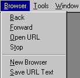

[← Help Contents](../index.md) | [📘 NLP++ Textbook](../NLP++_Textbook.md)

# Browser Menu

The Browser Menu provides access to the World Wide Web and various controls for browsers.

The Browser Menu corresponds to some functions on the** [Browser Toolbar.](Toolbars/Browser_Toolbar.md)**

| **Button** | **Menu Item** | **Description** |
| --- | --- | --- |
|  | **Back** | Loads previous Web page (if there is one) in the history list. Function is disabled if no Urls are in the history list. |
|  | **Forward** | Loads next Web page (if there is one) in the history list. Function is disabled if no Urls are in the history list. |
|   | **Open URL** | Launches dialog box to enter URL. Web page is opened in the Workspace. |
|  | **Stop** | Stops loading a Web page. |
|  | **New Browser** | Opens a new browser window. Browser opens to location of existing open browser. the desired Web address can be typed directly into the Location Input Panel. |
|  | **Save URL Text** | Copies the URL name and html file to the Text Tab. Function is enabled when a browser is selected in the Workspace. |
