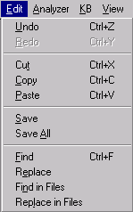

# Edit Menu

The Edit Menu controls actions done to files in the Workspace.

The Edit Menu corresponds to some buttons on the [Main Toolbar](Toolbars/Main_Toolbar.md).

When there is a corresponding element, the toolbar button is shown in the following table:

| **Button** | **Menu Item** | **Description** |
| --- | --- | --- |
|   | **Undo** | Reverses the last action performed in a file in the Workspace. |
|   | **Redo** | Reverses an Undo action performed in a file in the Workspace. |
|  | **Cut** | Deletes selected object in a Workspace file. |
|  | **Copy** | Copies selected object to the clipboard. |
|  | **Paste** | Pastes object from the clipboard at insertion point in currently selected file. |
|  | **Save** | Saves selected file in the Workspace. |
|  | **Save All** | Saves all unsaved files in the Workspace. |
|   | Find | Launches Find dialog box to search for item in open file. |
|   | Replace | Launches Replace dialog box to find and replace item in open file. |
|  | Find in Files | Launches Find in Files dialog box to search for items across multiple files. File type can be specified. Search results are displayed in the Find Window. |
|   | Replace in Files | Launches Replace in Files dialog box to find and replace items across multiple files. Search and replace results are displayed in the Find Window. |
