[← Help Contents](../index.md) | [📘 NLP++ Textbook](../NLP++_Textbook.md)

# File Menu

The File Menu is context sensitive. Available menu items change when a text file is open in the Workspace.  Here is the File Menu when all options are available.

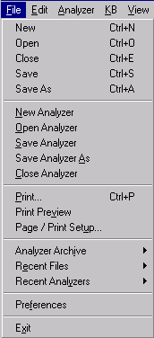

The File Menu corresponds to some elements in the [Main Toolbar](Toolbars/Main_Toolbar.md).

When there is a corresponding element, the toolbar button is shown in the following table:

| **Button** | **Menu Item** | **Description** |
| --- | --- | --- |
|  | **New** | Creates a new file and displays it in the Workspace window. |
|  | **Open** | Opens a file and displays it in the Workspace. |
|   | **Close** | Closes currently selected file in the Workspace. |
|  | **Save** | Saves currently selected file in the Workspace. |
|   | **Save As** | Saves currently selected file in the Workspace with a new name. |
|   | **New Analyzer** | Creates a new analyzer. Only one analyzer can be open at a time in an instance of VisualText™. If an existing analyzer is open, it will be closed and the new one loaded. Two instances of VisualText can be launched however, thereby having two different analyzers running at the same time. |
|   | **Open Analyzer** | Launches Open dialog box to navigate to location of .ana file to open the analyzer. |
|   | **Save Analyzer** | Saves currently loaded analyzer including the Knowledge Base. |
|   | **Save Analyzer As** | Saves currently loaded analyzer with a new name. |
|   | **Close Analyzer** | Closes currently loaded analyzer. |
|  | **Print** | Prints currently selected file in the Workspace. |
|   | **Print Preview** | Prints preview of currently selected file to the screen. |
|   | **Page / Print Setup** | Launches Page Setup dialog box with printing options. |
|   | **Analyzer Archive** | Submenu for archiving the analyzer. (See below.) |
|   | **Recent Files** | Lists recently opened files in a submenu. Selected file is opened in the Workspace. |
|   | **Recent Analyzers** | Submenu for selecting recently opened analyzers. (See below.) |
|   | **Preferences** | Launches VisualText Preferences dialog box to set various preferences. (See below.) |
|   | **Exit** | Exits the VisualText program. |

## Analyzer Archive Submenu

The archive functions allow you to load and store analyzers compactly in zip files either on a local machine or on a server. Archiving is used to create quick backups of your work and to facilitate communication between developers working on the same analyzers. Files are transmitted via FTP. The FTP parameters can be set by selecting the [Archiving](#archiving_Preferences) tab in Preferences. When you archive directly to the server, a file is created on your local disk. Information on uploading to the server is displayed in the Log Window.

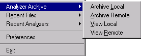

| **Menu Item** | **Description** |
| --- | --- |
| **Archive Local** | Launches an Archive dialog to create a local archive of the analyzer project file in a zip file. By default, the project is archived in the project directory. The name of archive file defaults to the name of the current analyzer, suffixed with the current date and time. User has option to save C files and log files for analyzer session. |
| Archive Remote | Launches an Archive dialog to create a remote archive of the analyzer project files in a zip file. An archive file is also created locally. Local archive location defaults to the project directory. The name of archive file defaults to the name of the current analyzer, suffixed with the current date and time. User has option to save C files and log files for analyzer session. |
| **View Local** | Displays analyzers in the local archive, and presents options to delete, rename, upload (send to server) or load into current analyzer Workspace. Listings in archive can be sorted by clicking on column headers. |
| **View Remote** | Displays analyzers in the server archive, and presents options to delete, rename, download (send to local archive) or load into current analyzer Workspace. Listings in archive can be sorted by clicking on column headers. |

## Archive Dialog

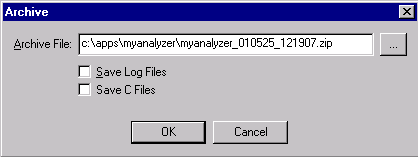

## View Local

## 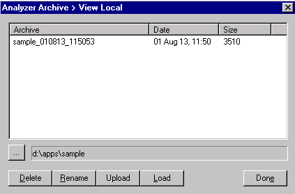

## View Remote

## 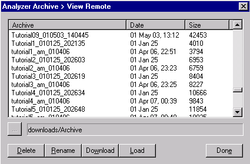

## Recent Analyzers Submenu

Selecting Recent Analyzers will bring up the list of recently loaded analyzers. The selected analyzer is opened in the Workspace. Selecting an analyzer closes an already open analyzer. The analyzer listed at the top of the list is the most current.

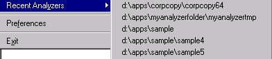

## Preferences

The Preferences menu item launches the VisualText Preferences dialog.  The VisualText Preferences dialog has tabs to set the following preferences:

- [General](#general_preferences)

- [Display](#Display_Preferences)

- [Email](#Email_Preferences)

- [Archiving](#archiving_Preferences)

- [Dictionary Lookup](#dictionaryLookup_pref)

- [Analyzer Dependent](#analyzerDependent_pref)

## General Preferences

The General Preferences tab allows you to set initialization, analyzer and application directory information.

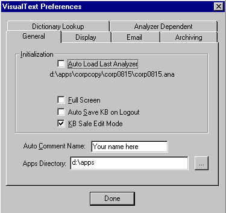

| **Dialog Item** | **Description** |
| --- | --- |
| **Auto Load Last Analyzer** | If checked, the last analyzer loaded will be loaded on program launch. The last analyzer loaded is displayed under the check box. If the check box is cleared, no analyzer is loaded on program launch. |
| **Full Screen** | If checked, VisualText launches into full screen. If the box is cleared, it launches in reduced screen. |
| **Auto Save KB on Logout** | If checked, automatically saves the knowledge base when exiting an analyzer. If not checked, user is prompted to save the knowledge base when exiting. |
| KB Safe Edit Mode | By default, checked when an analyzer is launched. Enabling this mode prevents manual editing of the gram and sys hierarchy concepts in the knowledge base, by greying out portions of KB Editor Popup Menu when the gram or sys hierarchy concepts are selected. Manual editing of the gram and sys hierarchies can easily corrupt the knowledge base. |
| **Auto Comment Name** | Name for current author or developer. Specified name will be added to the header comment section when pass files are generated. |
| Apps Directory | Path for the default directory for analyzer projects. |
| Done | Closes the VisualText Preferences dialog. |

## Display Preferences

The Display Preferences tab allows you to set preferences for the VisualText interface.

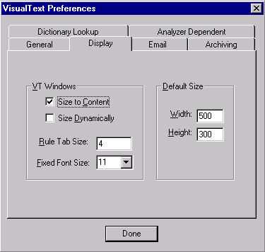

| **Dialog Item** | **Description** |
| --- | --- |
| **Size to Content** | If checked, window size for file when opened in the Workspace is determined by the content of the file. |
| **Size Dynamically** | If checked, then every window opened in the Workspace grows as the user expands items in that window. (Note: Window grows only to the default size specified in Preferences. Size to Content must also be checked. See Programming Notes and Issues.) |
| **Rule Tab Size** | Amount of indenting space in rule files. |
| **Fixed Font Size** | Default font size settings. |
| **Width** | Default width of files opened in VisualText Workspace. |
| Height | Default height of files opened in VisualText Workspace. |
| **Done** | Closes the VisualText Preferences dialog. |

## Email Preferences

The Email Preferences tab is where you set email related information.  Before you can use the [Email Tool](Tools/Tools_Email_Tool.md), you must these preferences.

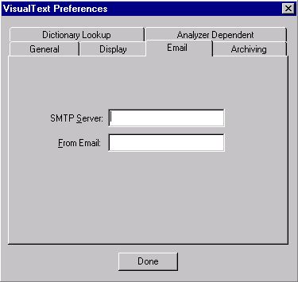

| **Dialog Item** | **Description** |
| --- | --- |
| **SMTP Server** | SMTP (Simple Mail Transport Protocol) address of the server where email is received. |
| From Email | Email address of author or developer. |
| Done | Closes the VisualText Preferences dialog. |

## Archiving Preferences

The Archiving Preferences tab is where you set server and user information.

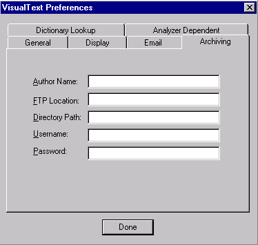

| **Dialog Item** | **Description** |
| --- | --- |
| **Author Name** | Name for archive author. |
| **FTP Location** | FTP site of archive. For example, ftp.companyName.com. |
| **Directory Path** | Location of archive at FTP site. For example, archiveDirectory/myArchives. |
| **Username** | Name used to log into FTP site. |
| Password | Password used to access FTP site. |
| Done | Closes the VisualText Preferences dialog. |

## Dictionary Lookup

The Dictionary Lookup Preferences tab is where you set up preferences for loading online dictionaries.  Dictionaries specified here are used by the [Dictionary Lookup Tool](Tools/Tools_DictionaryLookup.md).  The URL path for the WordNet dictionary is set by default.  Specified dictionaries are listed in the table once they are added.

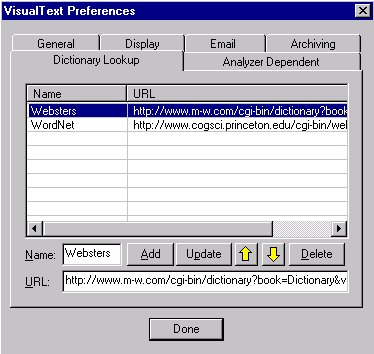

| **Dialog Item** | **Description** |
| --- | --- |
| Name | Input panel to specify the name of the online dictionary. |
| **URL** | Input panel to specify URL for online dictionary. For common online sites and more information on specifying URLs, see URLs for Dictionary Lookup. |
| Add | Adds specified online dictionary and URL to the list of dictionaries. |
| Update | Saves changes made to an existing dictionary entry. |
|  | Moves table selection up one position. |
|  | Moves table selection down one position. |
| Delete | Deletes selected table item. |
| Done | Closes the VisualText Preferences dialog. |

## Analyzer Dependent

The Analyzer Dependent Preferences tab is where you set analyzer dependent preferences.  When the Load Compiled KB box is checked, the compiled knowledge base is loaded when the analyzer is launched.

If the knowledge base has been edited during a session, upon exit the knowledge base will be compiled again.  If Auto Save KB on Logout is not checked, you will be prompted with a confirmation prompt.

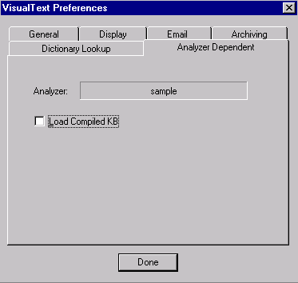
