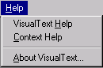

[← Help Contents](../index.md) | [📘 NLP++ Textbook](../NLP++_Textbook.md)

# Help Menu

The Help Menu provides access to the VisualText Help documentation and to general information about VisualText.

| **Menu Item** | **Description** |
| --- | --- |
| **VisualText Help** | Launches the VisualText Help documentation. |
| Context Help | Enables Context-Sensitive Help. |
| **About VisualText** | Launches VisualText product and version information. |
