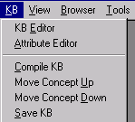

# KB Menu

The KB (Knowledge Base) Menu is used to control actions in the Knowledge Base.

The [Knowledge Base](Knowledge_Base.md) can store knowledge of any type. VisualText itself uses the KB to manage information, including the [Concept Hierarchy](Knowledge_Base.md#Concept_Hierarchy), the sequence of passes in the analyzer, the dictionary, and much more.

The KB Menu corresponds to the first part of the[Workspace Toolbar](Toolbars/Workspace_Toolbar.md):

The corresponding element on the toolbar button is shown in the following table:

| **Button** | **Menu Item** | **Description** |
| --- | --- | --- |
|  | **KB Editor** | Launches the KB Editor. |
|  | Attribute Editor | Launches the Attribute Editor. |
|  | **Compile KB** | Compiles the Knowledge Base. Action results in the creation of a KB.DLL. Preferences to load the compiled Knowledge Base can be set in Preferences from the File Menu. The KB.DLL library can be used with either an interpreted or compiled VisualText-built analyzer. |
|  | **Move Concept Up** | Moves a selected concept in the concept hierarchy 'up' one position. |
|  | **Move Concept Down** | Moves selected concept in the concept hierarchy down one position. |
|  | **Save KB** | Makes changes to the KB permanent. Changes made during a VisualText session are stored in memory. If KB is not saved, all changes made are lost upon exiting. |
