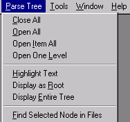

[← Help Contents](../index.md) | [📘 NLP++ Textbook](../NLP++_Textbook.md)

# Parse Tree Menu

The Parse Tree Menu controls actions with parse tree displays.

There are several ways to enable this menu. One way is by running an analyzer on an input file, then selecting **View > Parse Tree** from the Analyzer Menu or by clicking on the **Parse Tree** button .

Another way is by selecting **Analyzer > View > Concept Tree** or selecting the **Concept Tree** button .

Yet another way to activate the **Parse Tree** Menu, is by right clicking on a text that has been analyzed and selecting **View > Parse Tree**.

A tree display is affected by the selection of the Generate Logs button. If the analyzer has been run with Generate Logs on, the parse tree for the currently selected pass in the Ana Tab is displayed. If however, Generate Logs is off, the final parse tree is displayed.

These are the choices in the **Parse Tree Menu**:

| **Menu Item** | **Description** |
| --- | --- |
| **Close All** | Collapses the tree display to the root node only. |
| **Open All** | Expands all nodes in the tree display. |
| **Open Item All** | Expands all nodes under the selected node in the tree display. |
| **Open One Level** | Expands one level under the selected node in the tree display. |
| **Highlight Text** | Highlights the text in the input file corresponding to the selected node in the tree display. |
| **Display as Root** | Displays the selected node as the root of the tree display. Only the selected node is displayed. |
| **Display Entire Tree** | Displays the full parse tree, starting at the root, assuming that the current selection in the Text Tab has been analyzed. |
| **Find Selected Node in Files** | Searches for the selected node's name in the project files. Results are displayed in the Find Window. |

The **View > Node Variable Mode** menu item and the **View > Offsets Mode** menu item both affect the display of a parse tree as well.  The former displays variables and values for a node in a yellow box, and the latter displays the text start and end offset for each node in the parse tree.
