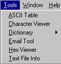
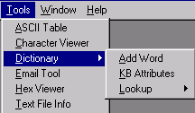

[← Help Contents](../index.md) | [📘 NLP++ Textbook](../NLP++_Textbook.md)

# Tools Menu

The Tools Menu controls the display of some of VisualText tools.  Tools listed in this menu are also available from the [Text Tab Popup](../Text_Tab_Popup.md) and the [Text File Popup](Popups/Text_File_Popup.md) menus.

| **Menu Item** | **Description** |
| --- | --- |
| **ASCII Table** | Displays the ASCII Table. ASCII Table displays the decimal and hexadecimal numbers and their corresponding ASCII characters. |
| Character Viewer | Launches an Open dialog to navigate to a file. Once file is selected, Character Viewer is displayed. Character Viewer shows the line number, cumulative count of total characters seen per line, characters on a line, and ASCII characters for each line of text in selected file. Under each line is the hexadecimal value of each character above it. |
| Dictionary | Submenu to perform dictionary related functions. (See below.) |
| Email Tool | Launches the Email Tool. Email Tool enables sending email directly from the VisualText interface. Preferences must be set in the Email tab of the VisualText Preference dialog which can be accessed by selecting **File** > **Preferences**. |
| Hex Viewer | Launches an Open dialog to navigate to a file. Once file is selected, Hex Viewer is displayed. |
| Text File Info | Launches an Open dialog to navigate to a file. Once file is selected, the Text File Info dialog is displayed. This tool provides statistics about the selected text file, including creation date, character, word and line counts. |

## Dictionary Submenu

The Dictionary menu option allows you to perform dictionary related functions.

| **Menu Item** | **Description** |
| --- | --- |
| Add Word | Launches a dialog to add a word to the dict hierarchy of the Knowledge Base. Words can only be added to the dict hierarchy one at a time. Word added to Knowledge Base is noted in Log Window. |
| KB Attributes | Launches a dialog to find a word in the dict hierarchy of the Knowledge Base and view its attributes. If there is an entry for the word in the dict hierarchy, the Attribute Editor is launched. If the word does not exist in the hierarchy, a message is written to the Log Window. |
| Lookup | Displays list of online dictionaries specified in the Dictionary Lookup Preferences tab. Selecting an option in the Lookup menu launches a dialog to search for a word in the selected online source. See Dictionary Lookup for more information on using this tool. |
