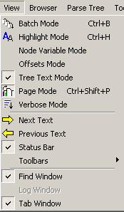
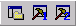
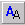
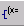
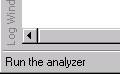
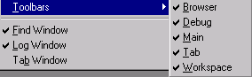

[← Help Contents](../index.md) | [📘 NLP++ Textbook](../NLP++_Textbook.md)

# View Menu

The View Menu controls the display of various windows and toolbars in the Interface.  The View Menu is also used to control certain VisualText modes.

Part of the View Menu corresponds roughly to the following sections of the [Workspace Toolbar and the](Toolbars/Workspace_Toolbar.md)[Debug Toolbar](Toolbars/Debug_Toolbar.md)

Another part corresponds to a piece of the [Main Toolbar](Toolbars/Toolbar.md#Main_Toolbar):

When there is a corresponding element, the toolbar button is shown in the following table:

| **Button** | **Menu Item** | **Description** |
| --- | --- | --- |
|  | Batch Mode | Instructs VisualText to analyze groups of files in an efficient mode. VisualText does not save intermediate and output files in batch mode. The text analyzer must explicitly create a location for output that is to be retained in batch mode. The NLP++™ function called batchstart() enables a text analyzer to check when the first text in a batch run is being analyzed. |
|  | Highlight Mode | When selected, enables highlighting of words or phrases in a text file matching selected pass in the Ana Tab or selected concept in the Gram Tab. Must be selected before an analyzer is run over text. This tool allows you to quickly see whether and where a rule is applying. |
|  | Node Variable Mode | When selected, enables the display of node variables in the parse tree. |
|   | Offsets Mode | Enables the display of offset information for terminal nodes in a parse tree display. Offset information is displayed as two numbers. For example [0,10], indicates the first character of the node starts at character position 0 (i.e. the first character on a line) and ends at character position 10. |
|   | Tree Text Mode | Parse tree displays text based on what is in the parse tree. If nodes are removed from the tree, such as HTML tags, then the parse tree view removes the tag text as well. |
|  | Page Mode | Maintains coordinated sets of documents. For example, when the user runs the analyzer, its corresponding output and tree windows are updated automatically. Similarly when selecting passes in the Ana Tab, Page Mode activates the Next Text and Previous Text buttons to its right. |
|  | Verbose Mode | Enables the display of details from the loading of the analyzer. Results are displayed in the Log Window. When a folder of files is analyzed, the processing time for each file is displayed. |
|  | **Next Text** | Displays the next input text file according to the ordering in the Text Tab. Works in Page Mode to automatically update the open documents associated with the input text. |
|  | **Previous Text** | Displays previous input text file according to the ordering in the Text Tab. Works in Page Mode to automatically update the open documents associated with the input text. |
|  | **Status Bar** | Displays status or description of GUI objects and actions. |
|   | **Toolbars** | Submenu that controls the visibility of toolbars in the VisualText Main Window. (See below.) |
|  | **Find Window** | Toggles the visibility of the Find Window. By default, the Find Window is located in the bottom right portion of the interface. |
|  | **Log Window** | Toggles the visibility of the Log Window. By default, the Log Window is located in the bottom left portion of the interface. |
|  | **Tab Window** | Toggles the visibility of the Tab Window. By default, the Tab Window is located in the middle left portion of the interface. |

## View Toolbars Submenu

| **Menu Item** | **Description** |
| --- | --- |
| **Browser** | Controls the display of the Browser Toolbar. |
| **Debug** | Controls the display of the Debug Toolbar. |
| **Main** | Controls the display of the Main Toolbar. |
| **Tab** | Controls the display of the Tab Toolbar. |
| **Workspace** | Controls the display of the Workspace Toolbar. |
