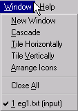

# Window Menu

The Window Menu controls the arrangement and display of open windows in the Workspace.

These options arrange the windows in the Workspace in standard ways. The bottom part of the menu consists of a list of windows and tools that are currently open in the Workspace. Selecting one of these brings the corresponding window to the foreground.

| **Menu Item** | **Description** |
| --- | --- |
| **Cascade** | Arranges the open windows in the Workspace in a staggered or cascaded sequence. |
| **Tile Horizontally** | Arranges the open windows in the Workspace in a horizontal stack. |
| **Tile Vertically** | Arranges the open windows in the Workspace in a vertical stack. |
| Arrange Icons | Arranges the minimized icons at the bottom of the Workspace window. |
| **Close All** | Closes all the open windows in the Workspace. |
