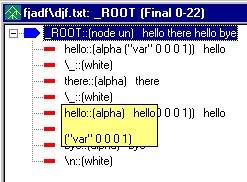

[← Help Contents](../../index.md) | [📘 NLP++ Textbook](../../NLP++_Textbook.md)

# Parse Tree Popup

The Parse Tree Popup menu is launched by selecting an item in a parse tree file in the Workspace and right mouse clicking.

The [Parse Tree Menu](../Main_Parse_Tree_Menu.md#Parse_Tree_Menu) on the Main Menu describes all of the items in this submenu.

  Toggle Node Variables button

With View > Node Variable Mode selected (or the Toggle Node Variables button depressed on the toolbar), placing the cursor near a parse tree node displays a yellow box with the node's variables and values, as below.

