[← Help Contents](../../index.md) | [📘 NLP++ Textbook](../../NLP++_Textbook.md)

# Pass File Popup

The Pass File Popup menu is launched by selecting a pass file in the Workspace and right mouse clicking. Many of the rule-editing actions assume that rules are in written in [standard rule format](../../VisualText_Basics/Standard_Rule_Format.md).

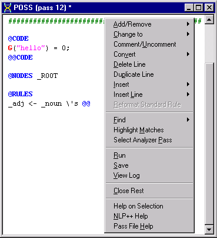

| **Menu Item** | **Description** |
| --- | --- |
| **Add/Remove** | Submenu for adding or removing phrase element modifiers at the selected line of a pass file. (See below.) |
| **Change to** | Submenu for editing special elements in the current rule. (See below.) |
| **Comment/Uncomment** | Comments or uncomments the currently selected line of a pass file. |
| **Convert** | Submenu for converting text to rules and for converting rules to standard format. (See below.) |
| **Delete Line** | Deletes selected line in a pass file. |
| **Duplicate Line** | Duplicates selected line in a file and inserts it below the current line. |
| **Insert** | Submenu for inserting a commonly used rule components at the current line. (See below.) |
| **Insert Line** | Submenu for inserting a special rule element below the current line. (See below.) |
| **Reformat Standard Rule** | Reformats a rule written in standard rule format. Cursor must be somewhere within the rule. This accelerator normalizes rules whose indentation and numbering have been altered by previous editing operations or by hand-editing. |
| **Find** | Submenu for finding selected item in a pass file. (See below.) |
| **Highlight Matches** | Highlights text in the current input text file based on the selection in the current pass file. If a rule element is selected in the pass file, then matches in the parse tree are used to highlight corresponding portions of the input text. If no item is selected in the pass file, the user is prompted to supply a rule element. |
| **Select Analyzer Pass** | Selects the pass in the analyzer sequence corresponding to the open pass file. Selected pass is highlighted in the Ana Tab if Ana Tab is currently open. If either the Gram Tab or the Text Tab are open, changes the display to the Ana Tab. |
| **Run** | Runs the analyzer on the currently selected input file. (Analyzers can not be run on files with a .log extension.) Same as Run Button on Workspace Toolbar and Run in the Analyzer Menu. |
| **Save** | Saves selected pass file. Same as **Save** in the Edit Menu and the **Save** button on the Main Toolbar. |
| **View Log** | If an intermediate log file is available, displays log file corresponding to the currently selected pass file. If intermediate log file is not available, displays the final.log file. |
| **Close Rest** | Closes all windows in the Workspace except currently selected one. |
| Help on Selection | Displays Help documentation on selected item. |
| **NLP++ Help** | Launches VisualText Help documentation for NLP++™. |
| **Pass File Help** | Displays Help for writing rules in pass files. |

## Add/Remove Submenu

The **Add/Remove** submenu adds or removes element modifiers for the rule element on the selected line. See [Phrase Element Modifiers](../../NLP_PP_Stuff/Phrase_element_modifiers.md) for detailed explanations of the various element actions.

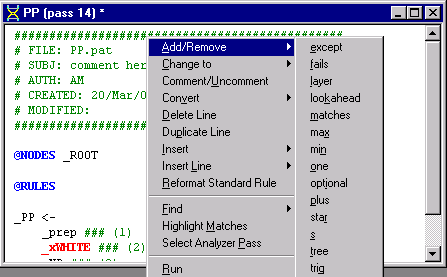

## Change To Submenu

The **Change To** submenu changes the name of the selected special rule element to the selected special rule element name (e.g., **_xWILD**).  See [Special Rule Elements](../../NLP_PP_Stuff/Special_rule_elements.md) for detailed explanations of the various element actions.

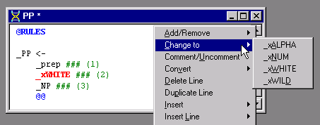

## Convert Submenu

Accelerators in the **Pass File Popup** menu operate on rules laid out with one element per line. The **Convert** submenu can format rules to the desired standard form the accelerators expect.

| **Menu Item** | **Description** |
| --- | --- |
| One Line to Standard Rule Format | Rewrites single line rule into the Standard Rule Format. Item is activated if cursor is on a rule whose elements are written on the same line. (See example below.) |
| String to Literal Rule | Converts a string of text into a literal rule. (See example below.) |
| String to General Rule | Converts a string of text into a general rule. (See example below.) |

## Convert One Line to Standard Rule Format

This editing tool changes a single line rule into a multi-line rule, with one rule element per line. Breaking up the rule elements like this makes writing NLP++™ rules easier, since statements that refer to rule elements refer to them by number, and counting rule elements across a single line seems more difficult than counting lines.

Using **One Line to Standard Rule Format** to format a one line rule like the one here:

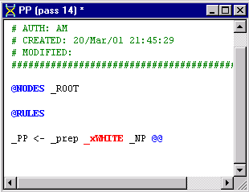

results in the following rule format:

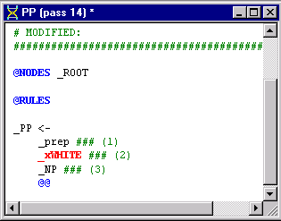

## Convert String to Literal Rule

This menu item converts a string into a literal rule, inserting default white spaces and rule element modifiers as well as comment symbols and rule element numbers.

Selecting **String to Literal Rule **for the text string, "**This is a test"**

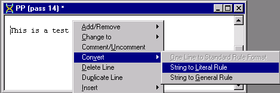

results in the following rule:

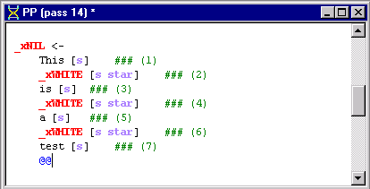

## Convert String to General Rule

Convert **String to General Rule** is similar to String to Literal Rule except that rule elements are abstracted to their variable types. Here's the output on the same example input, **This is a test**:

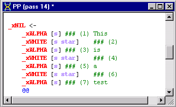

## Insert Submenu

The **Insert** submenu inserts a commonly used rule component at the current line. The submenu includes the most commonly used elements and also a default for directing the output to a file (Dump Phrase to File). The **Header** menu item inserts a comment line into the file.

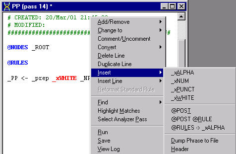

## Insert Line Submenu

The **Insert Line** submenu allows you to insert rule elements into a rule. The selected rule element is inserted on the line below the line the cursor is on. The selected rule elements are [_xALPHA](../../NLP_PP_Stuff/Special_rule_elements.md#xALPHA), [_xNUM](../../NLP_PP_Stuff/Special_rule_elements.md#xNUM), [_xSTART](../../NLP_PP_Stuff/Special_rule_elements.md#xSTART), [_xWHITE](../../NLP_PP_Stuff/Special_rule_elements.md#xWHITE), and [_xWILD](../../NLP_PP_Stuff/Special_rule_elements.md#xWILD).

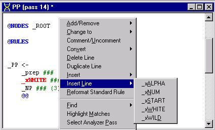

## Find Submenu

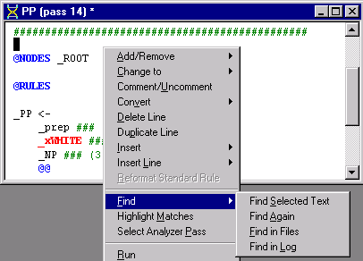

| **Menu Item** | **Description** |
| --- | --- |
| **Find Selected Text** | If item in pass file is highlighted, finds highlighted item in the pass file. If no item is selected, launches a dialog box to enter words or phrases to be searched in currently selected file. Target is highlighted in text. |
| **Find Again** | Searches for next occurrence of find target in currently selected file. Next found target is highlighted in text. |
| **Find in Files** | Launches a dialog box to enter words or phrases to be searched in multiple files in current analyzer. Search results are printed in the Find Window. |
| **Find in Log** | If item in pass file is highlighted, searches for highlighted item in the log file corresponding to currently selected pass in the analyzer sequence. If no item is highlighted, launches a dialog box to enter words or phrases to be searched in the corresponding log file for currently selected analyzer pass. The log file contains the file version of the pass output. Results are displayed in the log file in the Workspace. |
