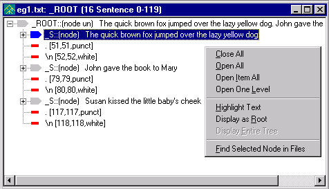

# Popup Menus

There are a number of popup menus in VisualText™. The main popup menus are provided for the following: [Ana Tab](#Ana_Tab), [Gram Tab](#Gram_Tab), [Text Tab](#Text_Tab), [Text Files](#Text_File), [Pass Files](#Pass_File), [Parse Trees](#Parse_Tree) and the [KB Editor](#kb_editor). To see a description of each of these menus, click on the titles below.

## [Ana Tab Popup](../../Ana_Tab_Popup.md)

The Ana Tab Popup controls activity in the analyzer sequence. To bring up this menu, select a pass in the Ana Tab and right mouse click.

## [Gram Tab Popup](../../Gram_Tab_Popup.md)

The Gram Tab Popup controls actions on the Gram Hierarchy. To bring up this menu, select a concept in the Gram Hierarchy and right mouse click.

## [Text Tab Popup](../../Text_Tab_Popup.md)

The Text Tab Popup organizes functions for operation in the Text Tab. To bring up this menu, select any folder or text file in the Text Tab and right mouse click.

## [Text File Popup](Text_File_Popup.md)

The Text File Pop controls actions to a selected text file in the Workspace. To bring up this menu, select the text file in the Workspace and right mouse click.

## [Pass File Popup](Pass_File_Popup.md)

The Pass File Popup controls functions for editing the rules contained within the pass file. To open this menu, open a pass file in the Workspace and right mouse click.

## [Parse Tree Popup](Parse_Tree_Popup.md)

The Parse Tree Popup controls actions to an item in a parse tree display. To bring up this menu, select an item in a parse tree display in the Workspace and right mouse click.

## [KB Editor Popup](../Tools/KB_Editor.md#kb_popup)

The KB Editor Popup controls actions to items in the Knowledge Base. To bring up this menu, right click in the body of the KB Editor.

.
