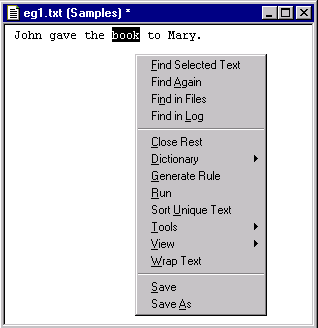
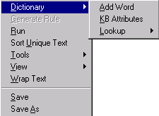
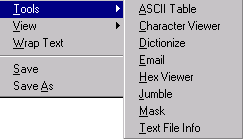
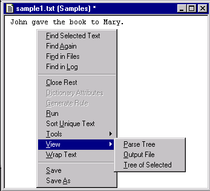
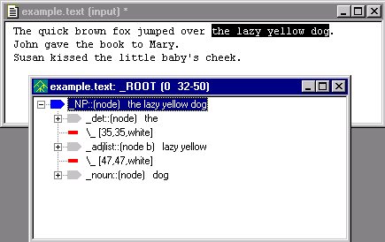

# Text File Popup

The Text File Popup menu is launched by selecting a text file in the Workspace and right mouse clicking.

| **Menu Item** | **Description** |
| --- | --- |
| **Find Selected Text** | Searches for highlighted text in file. If no text is highlighted, launches a dialog box to enter search term. Found search term is highlighted in text. |
| **Find Again** | Searches for next occurrence of find target in currently selected file. Next found target is highlighted in text. |
| **Find in Files** | Searches for highlighted text across multiple files in the current analyzer. If no word or phrase is highlighted in file, launches a dialog box to enter search terms. Search results are printed in the Find Window. |
| **Find in Log** | Searches for highlighted text in log files. If no word or phrase is highlighted in file, launches a dialog box to enter search terms. If an intermediate log file is available, search is performed in the log file corresponding to the currently selected pass in the analyzer sequence. If intermediate log file is not available, the final.log file is searched. |
| **Close Rest** | Closes all windows in the Workspace except currently selected one. |
| Dictionary | Submenu to perform dictionary related functions. (See below.) |
| **Generate Rule** | Automatically creates a rule from the currently selected text. Appends rule to the currently selected pass file in the Ana Tab. Generate Rule only works if you have previously run the analyzer on the text with the "Generate Logs" toggle turned on |
| **Run** | Runs the analyzer on the currently selected input file. (Note: analyzers can not be run on files with a .log extension.) Same as the Run Button on Workspace Toolbar and selecting **Run** from the Analyzer Menu. |
| **Sort Unique Text** | Sorts words in the currently selected text file in ascending alphabetic order. Multiple occurrences of words are discarded. Results are displayed in the currently selected text file. Useful in building sample files. |
| Tools | Submenu for accessing VisualText tools. (See below.) |
| View | Submenu for viewing parse tree, output files and parse tree of selected text. |
| **Wrap Text** | Launches a dialog to specify the maximum number of characters per line, then "wraps" the text lines to that limit. |
| **Save** | Saves currently selected file in the Workspace. |
| **Save As** | Saves currently selected file in the Workspace with a new name. Refresh the Text Tab to see the new file. |

## Dictionary Submenu

The Dictionary menu option allows you to perform dictionary related functions.

| **Menu Item** | **Description** |
| --- | --- |
| Add Word | Adds the highlighted word in a file to the dict hierarchy of the Knowledge Base. Words can only be added to the dict hierarchy one at a time. Only single words can be added. If the word already exists in the hierarchy a message is written to the Log Window. Log message is also written indicating which word is added. |
| KB Attributes | Highlighting a word in the text file and selecting KB Attributes launches the Attribute Editor. Attribute Editor is only launched if highlighted word exists in the dict hierarchy of the Knowledge Base. |
| Lookup | Displays list of online dictionaries specified in the Dictionary Lookup Preferences tab. Selecting an option in the Lookup menu starts a search in the online dictionary source. See Dictionary Lookup for more information on using this tool. |

## Tools Submenu

| **Menu Item** | **Description** |
| --- | --- |
| **ASCII Table** | Displays the ASCII Table. ASCII Table displays the decimal and hexadecimal numbers and their corresponding ASCII characters. |
| Character Viewer | Displays the Character Viewer for the selected file. Character Viewer shows the line number, cumulative count of total characters seen per line, characters on a line, and ASCII characters for each line of text in selected file. Under each line is the hexadecimal value of each character above it. |
| **Dictionize** | Activates the Dictionize Tool. |
| Email | Launches the Email Tool. Email Tool enables sending email directly from the VisualText interface. |
| Hex Viewer | Launches the Hex Viewer. |
| **Jumble** | Activates the Jumble Tool. This tool jumbles the letters in words in a text file. This tool is useful when looking for structural clues in a text, since it removes distracting content. Paragraph and sentence structure are preserved. |
| **Mask** | Activates the Mask Tool. This tool takes alphabetic content of a text with strings of the single letter 'a', but leaves the form, the non-alphabetic structure, including punctuation and white spaces. This tool is useful when looking for structural clues in a text, since it removes distracting content. |
| Text File Info | Displays the Text File Info dialog. This tool provides statistics about the selected text file, including creation date, character, word and line counts. |

## View Submenu

| **Menu Item** | **Description** |
| --- | --- |
| **Parse Tree** | Displays the full parse tree of a parsed document in the Workspace. This includes character position and white spaces in the document. |
| **Output File** | Displays output.txt file associated with parsed input document in the Workspace. |
| **Tree of Selected** | Displays parse tree for selected portion in a text file in the Workspace. |

## Example of Tree of Selected

