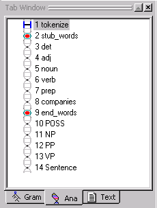
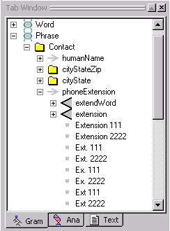
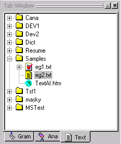

[← Help Contents](../index.md) | [📘 NLP++ Textbook](../NLP++_Textbook.md)

# Tab Window

There are three tabs in the **Tab Window**, [Ana](#Ana_Tab), [Gram](#Gram_Tab), and [Text](#Text_Tab)

## Ana Tab

The Ana Tab shows the analyzer sequence. This is where you control the text analyzer sequence, passes, and pass files. You can operate on the objects in the Ana Tab with buttons on the [Tab Toolbar](Toolbars/Tab_Toolbar.md) and with the [Ana Tab Popup Menu.](../Ana_Tab_Popup.md)

There are two types of passes:

[system pass](#system_pass) [user created pass](#user_created_pass)

**System Pass**

Currently, the only system pass available is the **tokenize** pass. System passes are identified by the rectangle icon.  System passes cannot be modified. The **tokenize** executes first, traversing the input text to convert it to a structure called a **parse tree**. Unlike user created passes, the tokenize and pass does not have an associated pass file.

**User Created Pass**

User created passes are added after the default system pass. User created passes can be identified by the DNA chain icon. The two types of user created passes are **Pattern** and **Recursive**. A pass in the analyzer sequence that is recursive is indicated by an **R** in the analyzer sequence.

A region of passes that have been generated automatically is called a **stub region**. The stub region is delimited by two red markers (labeled stub_NAME and end_NAME) in the analyzer sequence.

## Gram Tab

The Gram Tab is used to construct a concept (or sample) hierarchy and to sample data from input files to the concept hierarchy. You can operate on the objects in the Gram Tab by selecting them and using toolbar buttons and the [Gram Tab Popup Menu](../Gram_Tab_Popup.md).

## 

The Gram Tab can have five types of concepts:

- [stub concept](#stub_concept)

- [folder concept](#folder_concept)

- [rule concept](#rule_concept)

- [label concept](#label_concept)

- [sample concept](#sample_concept)

**Stub Concept**

The top level concept is the stub concept. It is identified by the DNA chain icon. The stub concept is associated with a region of automatically generated passes in the analyzer sequence. Folder and rule concepts can be direct descendants of stub concepts.

**Folder Concept**

The second level concept is the folder concept. This concept uses the folder icon. Folder concepts help organize related sets of samples. Folder and rule concepts can be direct descendants of folder concepts.

**Rule Concept**

The third level concept is the rule concept. Rule concepts are identified by the right-pointing arrow. Rule concepts own a set of related samples, from which the rule generator will generalize, merge, and generate rules. Label concepts and sample concepts can be direct descendants of rule concepts.

**Label Concept**

The fourth concept type is the label concept. Label concepts are identified by the triangle icon. Label concepts hold subsamples of larger samples. Label concepts can only be direct descendants of rule concepts.

**Sample Concept**

The final concept type is the sample concept. Samples are identified by a box icon. A sample concept stores a single sample or subsample. Sample concepts are placed under rule concepts and label concepts. (Note: in the KB, sample concepts are not directly in the hierarchy, but are implemented as phrase nodes owned by rule concepts and label concepts.)

## Text Tab

The Text Tab is where you organize and view input and output text data files. You can operate on the objects in the Text Tab by selecting them and using the [Text Tab Popup Menu](../Text_Tab_Popup.md), and with various toolbar buttons.

The Text Tab contains folders and files. When a text file has been analyzed, it will have a checkmark on it. Html files can be distinguished from the other text files by the globe icon.
