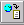
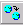
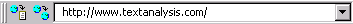

[← Help Contents](../../index.md) | [📘 NLP++ Textbook](../../NLP++_Textbook.md)

# Browser Toolbar

The Browser Toolbar provides access to the World Wide Web and various controls for browsers.

| **Button** | **Name** | **Description** |
| --- | --- | --- |
|  | Save URL Text | Copies the URL name and html file to the Text Tab. Function is enabled when a browser is selected in the Workspace. |
|  | New Browser | Opens a new browser window. If a browser is already open, new browser opens to same location as open browser. The desired Web address can be typed directly into the Location Input Panel. |
|  | Stop | Stops loading a Web page. |
|  | Back | Loads previous Web page (if there is one) in the history list. Function is disabled if no Urls are in the history list. |
|  | Forward | Loads next Web page (if there is one) in the history list. Function is disabled if no Urls are in the history list. |

|  | Location Input Panel | Input panel to open URL. |
| --- | --- | --- |
