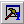
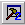

[← Help Contents](../../index.md) | [📘 NLP++ Textbook](../../NLP++_Textbook.md)

# Main Toolbar

The Main Toolbar provides access to commonly used functions such as opening, closing and saving files. It also contains the controls for toggling the Main Windows.

| **Button** | **Name** | **Description** |
| --- | --- | --- |
|  | New | Creates a new file and displays it in the Workspace window. |
|  | Open | Opens a file and displays it in the Workspace. |
|  | **Save** | Saves currently selected file in the Workspace. |
|  | Save All | Saves all unsaved files in the Workspace. |
|  | Cut | Deletes selected object in a Workspace file. |
|  | Copy | Copies selected object to the clipboard. |
|  | Paste | Pastes object from the clipboard at insertion point in currently selected file. |
|  | Print | Prints currently selected file in the Workspace. |
|  | Find in Files | Launches Find in Files dialog box to search for items across multiple files. File type can be specified. Search results displayed in the Find Window. |
|  | Find Previous | Searches for the last occurrence of an item in the find dialog. |
|  | Find Next | Searches for the next occurrence of an item in the find dialog. |
|  | Tab Window | Toggles the visibility of the Tab Window. By default, the Tab Window is located in the middle left portion of the interface. |
|  | Log Window | Toggles the visibility of the Log Window. By default, the Log Window is located in the bottom left portion of the interface. |
|  | Find Window | Toggles the visibility of the Find Window. By default, the Find Window is located in the bottom right portion of the interface. |
