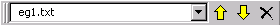
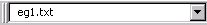

# Tab Toolbar

The Tab Toolbar presents controls for some objects in the Tab Window, and is active when the Ana Tab, Gram Tab or Text Tab are displayed.

| **Button** | **Name** | **Description** |
| --- | --- | --- |
|  | Move Tab Selection Up | Moves selected pass in the Ana Tab or concept in the Gram Tab up one position. |
|  | Move Tab Selection Down | Moves selected pass in the Ana Tab or concept in the Gram Tab down one position. |
|  | Delete in Tab Window | Deletes selected pass in the Ana Tab, concept in the Gram Tab or text file in Text Tab. |

|  | File Location Panel | Displays the name and path of currently selected file in the Text Tab. |
| --- | --- | --- |
