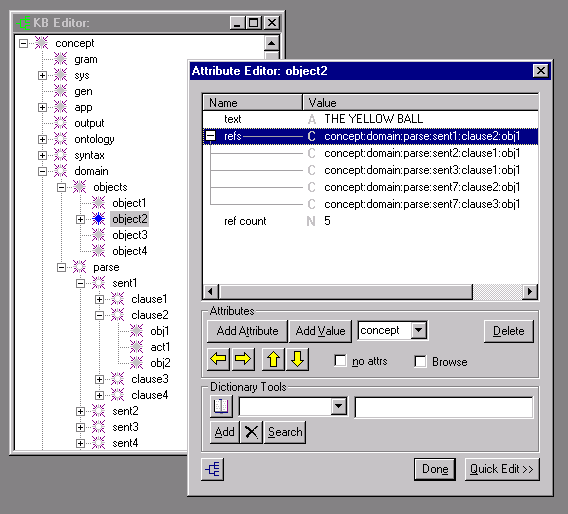
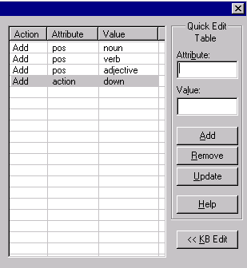

# Attribute Editor

## Function

The Attribute Editor allows the user to edit the attributes of a concept or node in the Knowledge Base.  An attribute consists of a **key** (or **slot**, or less accurately, a **name**) and zero or more **values**. A value can be a string, an integer, or another concept. Each attribute can have multiple values, each with a distinct type.

Version 1.4 of VisualText introduces enhancements to the Attribute Editor.  Concepts can now be viewed and edited, as values of attributes.  Navigation of the knowledge base from within the Attribute Editor has been made more convenient.

## Accessing

The Attribute Editor can be launched from several places within VisualText™.   The easiest is to use the Attribute Editor button  on the Workspace Toolbar.

Selecting Attributes from the [Gram Tab Popup Menu](../../Gram_Tab_Popup.md), the [Ana Tab Popup Menu](../../Ana_Tab_Popup.md), the [Phrase Tool](KB_Editor.md#phrase_tool_dialog), and the [Text Tab Popup Menu](../../Text_Tab_Popup.md) will launch the Attribute Editor.  You can also access the Attribute Editor from the [KB Menu](../Main_KB_Menu.md).

## Attribute Editor Description

The Attribute Editor is used to select attributes and/or values for the selected concept or node. Here is a list of the options in the Attribute Editor.

| **Item** | **Description** |
| --- | --- |
| (combo box) | The combo box determines the data type of the attribute value to be added or edited. Selecting an existing attribute and value will automatically update the combo box to the type of the value already present. Three knowledge base data types are currently supported: string (A), concept (C), and numeric (N). |
| **Add Attribute** | Create a new line in the display in which you can enter the name for the attribute. You must enter the first value for the attribute or it defaults to "New Value". |
| **Add Value** | Create a new line which represents an additional value for the selected attribute. |
| **Delete** | If there is only one value, delete the value and attribute pair. If there are multiple values, delete the value on the selected line. |
| no attrs | Move to a concept having no attributes. |
| Browse | (1) If a concept-valued attribute line is selected, checking the Browse box highlights the concept within the KB Editor window. (2) If the Browse button is checked, then clicking on a value field and then on a concept in the KB Editor selects that concept as the new value of the attribute. This enables convenient selection of a concept as the value of an attribute. |
| Quick Edit >> | Expand the Attribute Editor to include the Quick Edit Table. Commonly used attribute-value pairs can be listed in the Quick Edit Table to make adding and/or deleting attributes and attribute-value pairs easier. When Quick Edit Table is open, selecting button closes the Quick Edit Table display. (See below.) |
|  | Select previous or next concept. |
| (up down arrows) | Select the parent or child concept. |
|  | Launch the KB Editor if it is not already open. |
|  | Search an online dictionary for the concept currently being viewed in the Attribute Editor. The panel next to the dictionary icon can be used to specify which online dictionary to access. (For more information on setting dictionary access preferences, see the Dictionary Lookup preferences tab which can be accessed from the File Menu under Preferences.) |
|  | Search input panel. Searches for word in the dict hierarchy. If item exists in the dict hierarchy, the attributes for word are displayed. The search input panel locates words in the concept:sys:dict hierarchy only. |
| Add | Add a word concept to the dict hierarchy. |
|  | Delete a word concept from the dict hierarchy. |
|  | Search button. Start search for item entered in input panel. |
| **Done** | Close the Attribute Editor. |

An attribute may have multiple values. For example, the attribute named "algo" may have values "pat", "hello there", and "170224929." By selecting a line and clicking Add Value, successive values can be added. One can even mix the types of values (numeric, "N", and string, "A") arbitrarily.

The Attribute Editor is now smart enough to be able to treat "123" as both a string or numeric type, depending on the type chosen in the combo box.  Similarly, "concept:gram" may represent a concept in the KB or a string, depending on the type chosen in the combo box.

Concept naming in the attribute editor looks like *concept:child:grandchild:greatgrandchild* and so on.  The concept named "concept" specifies the root of the KB hierarchy, and colons (':') separate each successive child.

| **Notes**: (1) The "name" of an attribute is actually a concept in the KB, not merely a string. (2) There is currently no way to specify a colon as part of the name of a concept, in the attribute editor. |
| --- |

| **WARNING**: Editing the **gram** or **sys** hierarchies manually can easily corrupt the KB, so please make a backup copy of your analyzer project before experimenting. The Gram Tab is the safest way to edit the Gram hierarchy. |
| --- |

## Quick Edit Table

The Quick Edit Table is used to store commonly used attribute-value pairs.  Attributes can be added to the selected concept by double-clicking the attribute-value line in the Quick Edit Table or by selecting the line in the table and clicking on the **<< KB Edit** button.  **Add** in the Action column indicates the attribute-value pair will be added to the concept.  Once a concept is added, the Action column changes to Del (for delete).  Double-clicking on a Del line will delete the attribute-value pair from the concept.

| **Item** | **Description** |
| --- | --- |
| **Attribute** | Input box to add attribute to Quick Edit Table. Added attribute appears in the **Attribute** column. |
| **Value** | Input box to add value for given attribute to Quick Edit Table. Added value appears in the **Value** column. |
| **Add** | Adds attribute-value pair to the Quick Edit Table. |
| Remove | Removes selected attribute-value pair from the Quick Edit Table. To remove multiple attribute-value pairs at the same time, hold down the shift key and select the attribute-value lines in the Quick Edit Table you want to delete. |
| Update | Updates changes made to attribute-value pair in the Quick Edit Table. |
| Help | Launches instructions on using the Quick Edit Table. |
| << KB Edit | Assigns selected attribute-value pair to the selected concept. To assign multiple attribute-value pairs at the same time, hold down the shift key and select the appropriate attribute-value lines in the Quick Edit Table. |
