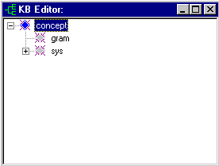
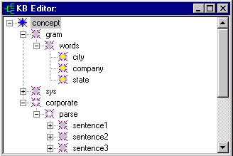
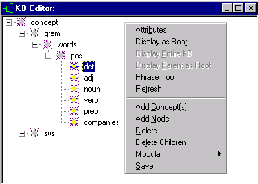
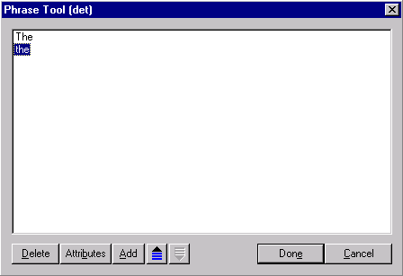
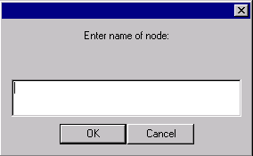

# KB Editor

## Function

The KB Editor displays the [Knowledge Base](../../VisualText_Basics/About_the_Knowledge_Base.md) and allows you to manipulate portions of it.

## Accessing

The KB Editor can be accessed by selecting the **KB Editor **button  on the Workspace Toolbar, or by selecting KB Editor from the [KB Menu](../Main_KB_Menu.md).  You can also access the KB Editor from the [Attribute Editor](Attribute_Editor.md).

## Concept Hierarchy Display

The KB Editor displays a hierarchy of concepts. The major organization of this Conceptual Grammar™ Knowledge Base Management System is a hierarchy of concepts.

**concept** is the root of the concept hierarchy. It is the topmost concept in the knowledge base.  The child concept **gram** is where the Sample Hierarchy (or Gram Hierarchy) is implemented. Other VisualText™ and KB internals are stored in **sys**. The dictionary hierarchy (**dict**), the analyzer sequence and a mirror for input files are stored under **sys**.

## Concept Icons

Concept icons in the KB Editor are color-coded.  You can tell several things about a concept just by looking at the color of the icon.

| Color | Description |
| --- | --- |
| Blue | Concept in selected. |
| **Yellow** | Concept has an associated phrase. |
| Grey | Concept has attributes |
| Clear (hollow) | Concept has no attributes. |

## Using the KB Editor

The KB Editor is used to modify current concepts and to add new concepts to the concept hierarchy when building representation schemes. The existing hierarchies may be modified, but it is not recommended to edit *system attributes* of concepts. Also, note that the **gram **and** sys** subhierarchies should not be hand-edited using the KB Editor.

The Attribute Editor can be used to manually add or modify attributes.  However, whenever feasible users should edit concepts using the [Gram Concept Properties](../../Setting_Rule_Generation_Properties.md#gramConProp) dialog. The Gram Concept Properties dialog is accessed by selecting Properties from the [Gram Tab Popup Menu](../../Gram_Tab_Popup.md).

## KB Editor Popup Menu

To edit using the KB Editor, select a node and right click to bring up the** **KB Editor Popup Menu:

## 

| **Item** | **Description** |
| --- | --- |
| **Attributes** | Launches the Attribute Editor dialog and displays the attributes belonging to the selected concept in the KB. User has option to delete, add or change names of attributes and values. |
| **Display as Root** | Displays selected concept as the root of the concept hierarchy. |
| **Display Entire KB** | Displays the entire knowledge base starting at root. |
| **Display Parent as Root** | Displays parent of concept currently displayed as root. |
| Phrase Tool | Launches the Phrase Tool. Displays the phrase, if any, of a selected concept in the Knowledge Base. User can add edit or delete nodes of a concept's phrase. (See below.) |
| **Refresh** | Refreshes the KB Editor display. |
| **Add Concept(s)** | Adds a new concept under the selected concept. |
| **Add Node** | Adds a new node to the concept's phrase. |
| **Delete** | Deletes the selected concept and its subtree. |
| **Delete Children** | Deletes the subtree of a selected concept, but retains the concept itself. |
| Modular | Submenu for saving and loading modular KB files. (See below.) |
| **Save** | Saves the KB. |

| **Note**: To prevent users from inadvertently corrupting the knowledge base, analyzers are loaded in **KB Safe Edit Mode**. With KB Safe Edit Mode enabled, **Add Concept**, **Add Node**, **Delete**, **Delete Children** options on the KB Editor Popup Menu are not available when either the gram concept or the sys concept is selected. You may disable KB Safe Edit Mode by unchecking the **KB Safe Edit Mode** box on the General Preferences tab. Users are advised to create backups before using the KB Editor when KB Safe Edit Mode is turned off. |
| --- |

## Phrase Tool

In the Conceptual Grammar knowledge base, each concept may have one associated **phrase**. A phrase consists of **nodes**, which are basically concepts that are not attached directly to the KB hierarchy.

A phrase is a convenient way to embed sequential information of any type in the knowledge base. For example, if you browse the **concept > gram** subhierarchy of the KB, you will find that the sample hierarchy stores user-highlighted samples as phrases (each sample is actually a node of the phrase belonging to a rule concept).

The Phrase Tool lets you view and edit the phrase that belongs to the currently selected concept. Each line in the Phrase Tool represents one node. Only the name of the node is visible, but double-clicking a node or selecting the Attributes button brings up the Attribute Editor for the current node.

## Phrase Tool Description

| **Item** | **Description** |
| --- | --- |
| **Delete** | Deletes the selected node. |
| **Attributes** | Launches the Attribute Editor for the selected node. |
| **Add** | Launches the Add Node dialog to add a node to the current phrase. (See below.) |
|  | Moves the selected node up one position in the phrase. |
|  | Moves the selected node down one position in the phrase. |
| **Done** | Saves changes to the phrase and closes the Phrase dialog box. |
| **Cancel** | Cancels the changes to the phrase. |

| **Note**: If the analyzer has been loaded in **KB Edit Safe Mode**,** **the only option available in the Phrase Tool when viewing gram or sys concepts is the Attributes button.** ** |
| --- |

## Add Node Dialog

The **Add Node** dialog appears when adding a node to a concept's phrase, either from the Phrase Tool or the KB Editor Popup Menu > Add Node menu item. To add a node, you merely specify a name for it. You may edit an existing node's attributes with the [Attribute Editor](Attribute_Editor.md).

## Modular Submenu

| **Item** | Description |
| --- | --- |
| Load |   |
| Save |   |
