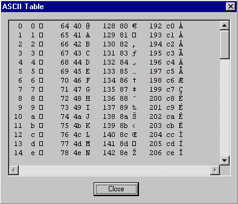

# ASCII Table

## Function

The ASCII Table is used to display the decimal and hexadecimal numbers and their corresponding ASCII characters.

## Accessing

The ASCII Table can be displayed from several places within VisualText.  It can be accessed from the main [Tools Menu](../Main_Tools_Menu.md), the [Text Tab Popup Menu](../../Text_Tab_Popup.md) under Tools, and from the Tools submenu in the [Text File Popup Menu](../Popups/Text_File_Popup.md).

## ASCII Table Display

