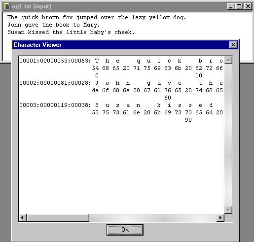

[← Help Contents](../../index.md) | [📘 NLP++ Textbook](../../NLP++_Textbook.md)

# Character Viewer

## Function

The Character Viewer Tool is used to get information on lines of text and the characters used in each line of text.

## Accessing

The Character Viewer Tool can be displayed from several places within VisualText.  It can be accessed from the main [Tools Menu](../Main_Tools_Menu.md), the [Text Tab Popup Menu](../../Text_Tab_Popup.md) under Tools, and from the Tools submenu in the [Text File Popup Menu](../Popups/Text_File_Popup.md).

The Character Viewer Tool can be launched for an open file in the Workspace.  If no file is open in the Workspace, an Open dialog is launched to navigate to the desired text file.

## Character Viewer Tool Display

The Character Viewer Tool shows the line number, a cumulative count of total characters seen per line, the characters on a line, and the ASCII characters for each line of text in selected file. Under each line is the hexadecimal value for each character above it.

