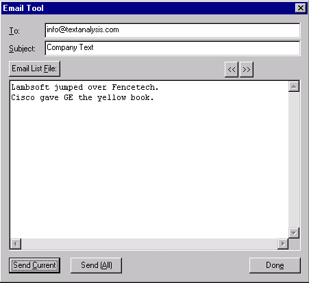

[← Help Contents](../../index.md) | [📘 NLP++ Textbook](../../NLP++_Textbook.md)

# Email Tool

## Function

The Email Tool enables you to send email directly from the VisualText interface.

## Accessing

The Email Tool can be accessed from several places within VisualText.  It can be accessed from the main [Tools Menu](../Main_Tools_Menu.md), the [Text Tab Popup Menu](../../Text_Tab_Popup.md) under Tools, and from the Tools submenu in the [Text File Popup Menu](../Popups/Text_File_Popup.md).

## Setting Email Tool Preferences

Preferences for the Email Tool can be set under the Email Tab in VisualText preferences under the File Menu.  SMTP Server and From Email must be set before the Email Tool can be used.

## Email Tool Display

When the Email Tool is selected, the content of the selected file is automatically filled into the body of the message.

| **Menu Item** | **Description** |
| --- | --- |
| **To:** | Field to enter email recipient. If text file contains "to: person@emailaddress" field is automatically entered with information from file. |
| **Subject:** | Field to enter email subject. If text file contains "subject: subject of email" field is automatically entered with information from file. |
| **Email List File:** | Allows user to browse to a folder of email files to be sent. |
| **<<** | Allows user to move to previous file in the email folder. |
| **>>** | Allows user to move to the next file in the email folder. |
| **Send Current** | Sends the current email. |
| **Send All** | Emails all the files in the current folder. |
| Done | Closes the Email Tool display. |
