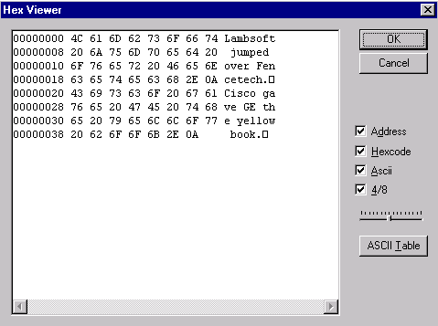

[← Help Contents](../../index.md) | [📘 NLP++ Textbook](../../NLP++_Textbook.md)

# Hex Viewer

## Function

The Hex Viewer provides various views of the characters in a text file.

## Accessing

The Hex Viewer can be accessed from several places within VisualText.  It can be accessed from the main [Tools Menu](../Main_Tools_Menu.md), the [Text Tab Popup Menu](../../Text_Tab_Popup.md) under Tools, and from the Tools submenu in the [Text File Popup Menu](../Popups/Text_File_Popup.md).

## Hex Viewer Display

The ASCII Table button displays the table of ASCII codes.  You can also see the address, hexcodes, equivalent ASCII characters, and full 8-digit addresses for each character in the text. The slider determines the number of characters displayed per line.

