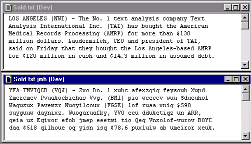

# Jumble Tool

## Function

Jumble is a simple non-graphic tool that converts a text file to a version that facilitates studying the format of the file. Jumble randomly changes the order of letters in the text file leaving punctuation and capitalization intact.

## Accessing

The Jumble Tool can be accessed from several places within VisualText.  It can be accessed from the [Text Tab Popup Menu](../../Text_Tab_Popup.md) under Tools, and from the Tools submenu in the [Text File Popup Menu](../Popups/Text_File_Popup.md).

## Using the Jumble Tool

**To use the Jumble Tool**:

1. Select the **text** in the Text Tab.

1. From the right-click Menu, select **Tools** > **Jumble**.  A .jmb (for jumble) file for the selected text is created in the same folder as the text.  (You can also open the text file in the Workspace and select Tools > Jumble from the right-click menu.)

## Jumble Example

