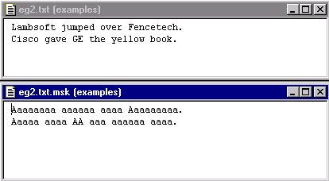

[← Help Contents](../../index.md) | [📘 NLP++ Textbook](../../NLP++_Textbook.md)

# Mask Tool

## Function

Mask is a simple non-graphic tool that converts a text file to a version that facilitates studying the format of the file. All alphabetic characters are converted to "a" or "A", retaining capitalization of the input text.

## Accessing

The Mask Tool can be accessed from several places within VisualText.  It can be accessed from the [Text Tab Popup Menu](../../Text_Tab_Popup.md) under Tools, and from the Tools submenu in the [Text File Popup Menu](../Popups/Text_File_Popup.md).

## Using the Mask Tool

**To use the Mask Tool**:

1. Select the **text** in the Text Tab.

1. From the right-click Menu, select **Tools** > **Mask**.  A .msk (for mask) file for the selected text is created in the same folder as the text.  (You can also open the text file in the Workspace and select Tools > Mask from the right-click menu.)

## Mask Example

