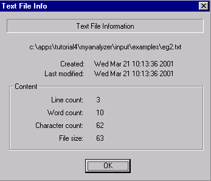

[← Help Contents](../../index.md) | [📘 NLP++ Textbook](../../NLP++_Textbook.md)

# Text File Info

## Function

The Text File Info dialog displays information about a text file.

## Accessing

The Text File Info dialog can be displayed from several places within VisualText.  It can be accessed from the main [Tools Menu](../Main_Tools_Menu.md), the [Text Tab Popup Menu](../../Text_Tab_Popup.md) under Tools, and from the Tools submenu in the [Text File Popup Menu](../Popups/Text_File_Popup.md).

## Text File Info Display

The Text File Info dialog provides the location of the selected file, creation and modification dates, line count, word count, character count, and file size.

