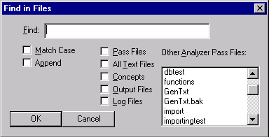

# Find in Files Dialog

The **Find in Files** dialog** **allows you to** **find text in multiple files.

## Accessing

The **Find in Files** dialog is launched by selecting Find in Files from the Edit Menu or by selecting the Find in Files icon.  

You can constrain the search by selecting specific file types or by selecting another analyzer project.  Search results are displayed in the [Find Window](../../Find_Window.md).

| **Dialog Item** | **Description** |
| --- | --- |
| Find | Input panel to type text to be searched. |
| Match Case | Searches text matching exact case of search term. |
| Append | Appends search results to the Find Window. When Append is not checked, Find Window results are cleared before results from new search are displayed. |
| Pass Files | Searches for search term in pass files. |
| All Text Files | Searches for search term in all text files. |
| Concepts | Searches for search term in Gram Tab concepts. |
| Output Files | Searches for search term in output files. |
| Log Files | Searches for search term in log files. |
| Other Analyzer Pass Files | Shows other analyzer projects. Selecting analyzer project enables search in pass files of specified project. |
| OK | Starts the search. |
| Cancel | Closes the Find in Finds dialog box. |
