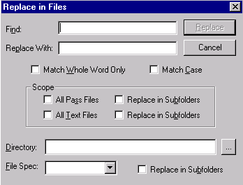

[← Help Contents](../../index.md) | [📘 NLP++ Textbook](../../NLP++_Textbook.md)

# Replace in Files Dialog

The **Replace in Files** dialog** **allows you to** **replace text in multiple files.

The **Replace in Files** dialog is launched by selecting **Replace in Files** from the Edit Menu.  You may specify the files where text should be replaced.   Search and replace results are displayed in the [Find Window](../../Find_Window.md).

| **Dialog Item** | **Description** |
| --- | --- |
| Find | Input panel to type search term. |
| Replace With | Input panel to specify what found text should be replaced with. |
| Replace | Starts the search and replace function. Results of Replace displayed in Find Window. |
| Cancel | Closes the Replace in Files dialog box. |
| Match Whole Word Only | Searches text matching whole words only. |
| Match Case | Searches text matching exact case of search term. |
| All Pass Files | Searches for search term in all pass files. |
| All Text Files | Searches for search term in all text files. |
| Replace in Pass Subfolders | Replaces instances of found search term in all pass file subfolders. |
| Replace in Text Subfolders | Replaces instances of found search term in all text file subfolders. |
| Directory | Input panel to specify directory to perform search. |
| File Spec | Specifies files to search by file extension. |
| Replace in Subfolders | Replaces instances of found search term in all subfolders. |
