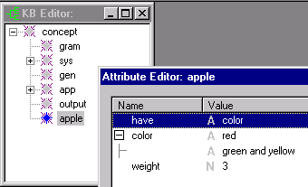

# getsval

## Purpose

Fetch value as a string from a numeric or string-valued KB value object.

## Syntax

```
returnedString = getsval(aValue);
```

```
returnedString - type: str

aValue - type: val
```

## Returns

A string, *returnedString*, representing the name of the input value, *aValue*.

## Remarks

Concepts can have zero or more attributes. Each attribute can have zero or more values. This function takes a value as argument and returns the string name associated with the input argument value. Differs from `getstrval`, in that `getsval` can handle either numerical or string values in aValue, while `getstrval` expects a string. Differs from `getnumval` in that `getnumval` expects a number in aValue. If passed a bad argument value, the function writes an error message to the output log.

## Example

To demonstrate getsval, we first need to build a KB:

```
# if you find apples in the concept hierarchy

if (findconcept(findroot(),"apple"))

# kill them (to start fresh)

rmconcept(findconcept(findroot(),"apple"));

# Create the apple concept

G("apple") = makeconcept(findroot(),"apple");

# Apples have color

addstrval(G("apple"),"have","color");

# Apple's color is red

addstrval(G("apple"),"color","red");

# Apple's weigh 3 something or others

addnumval(G("apple"),"weight",3);

# Apple's color is also green and yellow

addstrval(G("apple"),"color","green and yellow");
```

The code creates a KB like this:

```

```

(To launch Attribute Editor, select the concept in the KB Editor, right mouse click and select Attributes from the popup menu).

The following code accesses the KB's attributes and values:

```
"output.txt" << "Apple's attrs 'n vals:\n";

# Find apple's attribute's

G("attrList") = findattrs(G("apple"));

# cycle through all of apple's attributes

G("attr counter") = 1;

while(G("attrList")){

"output.txt" << G("attr counter") << ")\t" <<

attrname(G("attrList")) << "\n";

# get the attribute's list of values

G("valList") = attrvals(G("attrList"));

# cycle through all the values

G("val counter") = 1;

while(G("valList")) {

"output.txt" << "\t" << G("val counter") << ")\t" <<

getsval(G("valList")) << "\n";

G("valList") = nextval(G("valList"));

G("val counter")++;

}

# get the next attribute

G("attrList") = nextattr(G("attrList"));

G("attr counter")++;

}
```

The output looks like this:

```

```

## See Also

[getconval](getconval.md), [getnumval](getnumval.md), [getstrval](getstrval.md), [Knowledge Base Functions](Table_of_Knowledge_Base_Functions.md)
