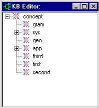

[← Help Contents](index.md) | [📘 NLP++ Textbook](NLP++_Textbook.md)

# movecright

## Purpose

Move a concept *childConcept* after next sibling.  (Moves the concept to the 'right' or 'lower' in the pecking order.)

## Syntax

```
None = movecright(childConcept)
```

```
childConcept - type: con
```

## Returns

nothing

## Remarks

If you try to move a concept beyond the last concept, a message is written to the output log.

## Example

```
@CODE

"output.txt" << "move\n";

G("alpha") = makeconcept(findroot(),"first");

G("beta") = makeconcept(findroot(),"second");

G("gamma") = makeconcept(findroot(),"third");

movecleft(G("gamma"));

movecright(G("alpha"));
```

This prints the following to output.txt:

```
move
```

After this code is executed, the KB Editor looks like this:

```

```

## See Also

[movecleft](movecleft.md), [Knowledge Base Functions](Table_of_Knowledge_Base_Functions.md)
