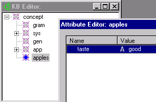

[← Help Contents](index.md) | [📘 NLP++ Textbook](NLP++_Textbook.md)

# rmattrs

## Purpose

Remove all of the attributes (and values) of a concept *aConcept*.

## Syntax

```
None = rmattrs(aConcept)
```

```
aConcept - type: con
 
```

## Returns

1 if removed, 0 otherwise.

## Remarks

Removes all attributes of the given concept except for hidden system attributes. Differs from `rmattr` in that `rmattr` removes values of a specific attribute (e.g. `rmattr(G("apples"),"color");`) while `rmattrs` removes all attributes.

## Example

This example creates the concept apple, then creates two attributes of apple, then deletes both of them. Finally, we add both of the attributes back and then delete only one.

```
if(findconcept(findroot(), "apples"))

rmconcept(findconcept(findroot(), "apples"));

G("apples") = makeconcept(findroot(), "apples");

addstrval(G("apples"), "color", "red");

addstrval(G("apples"), "taste", "good");

rmattrs(G("apples"));

addstrval(G("apples"), "color", "red");

addstrval(G("apples"), "taste", "good");

rmattr(G("apples"),"color");
```

The KB Editor should look like this:

```

```

## See Also

[rmattr](rmattr.md), [Knowledge Base Functions](Table_of_Knowledge_Base_Functions.md)
