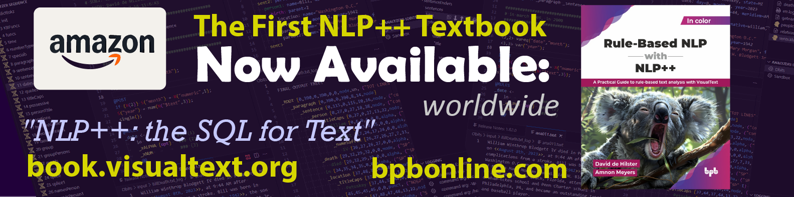

# 📢 Announcement — The NLP++ Textbook is Here

**The first textbook on the NLP++ programming language is now available world-wide.**

Written for programmers, it takes you from the basics to building real analyzers that parse
text and extract information **deterministically** — no training data, just rules you write
and can read, test, and ship. A strong, auditable alternative to an LLM in agentic flows.

**Get your copy:**

- 🛒 **Amazon** — [amazon.visualtext.org](https://amazon.visualtext.org)
- 🛒 **BPB Online** — [book.visualtext.org](https://book.visualtext.org)

_See more on the [Help home](../home.md)._