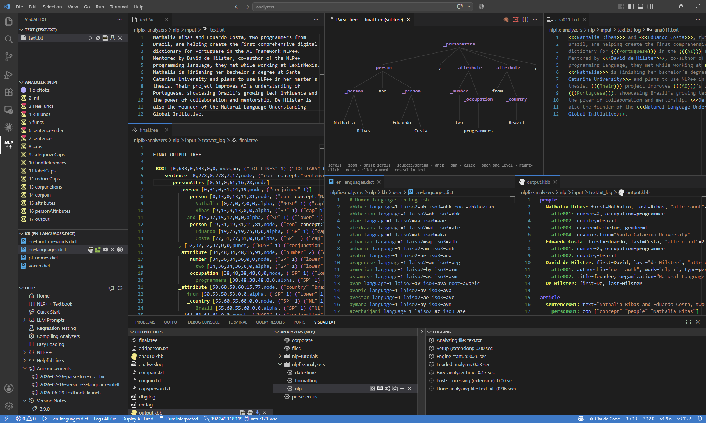

# 📢 Announcement — A Picture Worth a Thousand Words

**Take a minute with that picture.** Everything in it came from one click of ▶ on a
twelve-line text file — and it finished in **0.96 seconds**.

Look at what's on screen at the same time:

- The **text** being analyzed, and beside it the **parse tree drawn as a tree** — phrases
  branching over their words, the way a linguist would sketch it.
- The same tree as **text**, every node with its exact span, right below the picture.
- The **entities found**, marked in place in the original text: `<<<Nathalia Ribas>>>`,
  `<<<David de Hilster>>>`, `<<<Natural Language Understanding Global Initiative>>>`.
- The **knowledge base the run built** — Nathalia Ribas, `occupation=programmer`,
  `country=brazil`, `organization="Santa Catarina University"` — assembled from the sentence,
  not looked up anywhere.
- The **seventeen passes** that did it, numbered in order down the left.
- The **dictionaries** they consulted, and a **timing breakdown** of where every fraction of
  that second went.

No terminal. No switching windows. No "now go find the output file."

---

## The thousand words

That screenshot is Version 3. It began by making analyzers **compiled to native C++**,
**built in the cloud**, and **published to npm** — and has since become a genuine IDE for
NLP++: go to definition across passes and into `.kbb` concepts, find references, rename,
IntelliSense, code folding, semantic highlighting, and engine errors turned into inline
squiggles on the exact line that caused them. Underneath: a lossless formatter, a regression
runner, stand-alone analyzer deploys, and cloud compile with no local toolchain.

But you already knew most of that from the picture.

**Read the full summary:** [Version 3 — NLP++ Is Now a First-Class Language in VS Code](../versions/3.9.0.md)

_See more on the [Help home](../home.md)._
