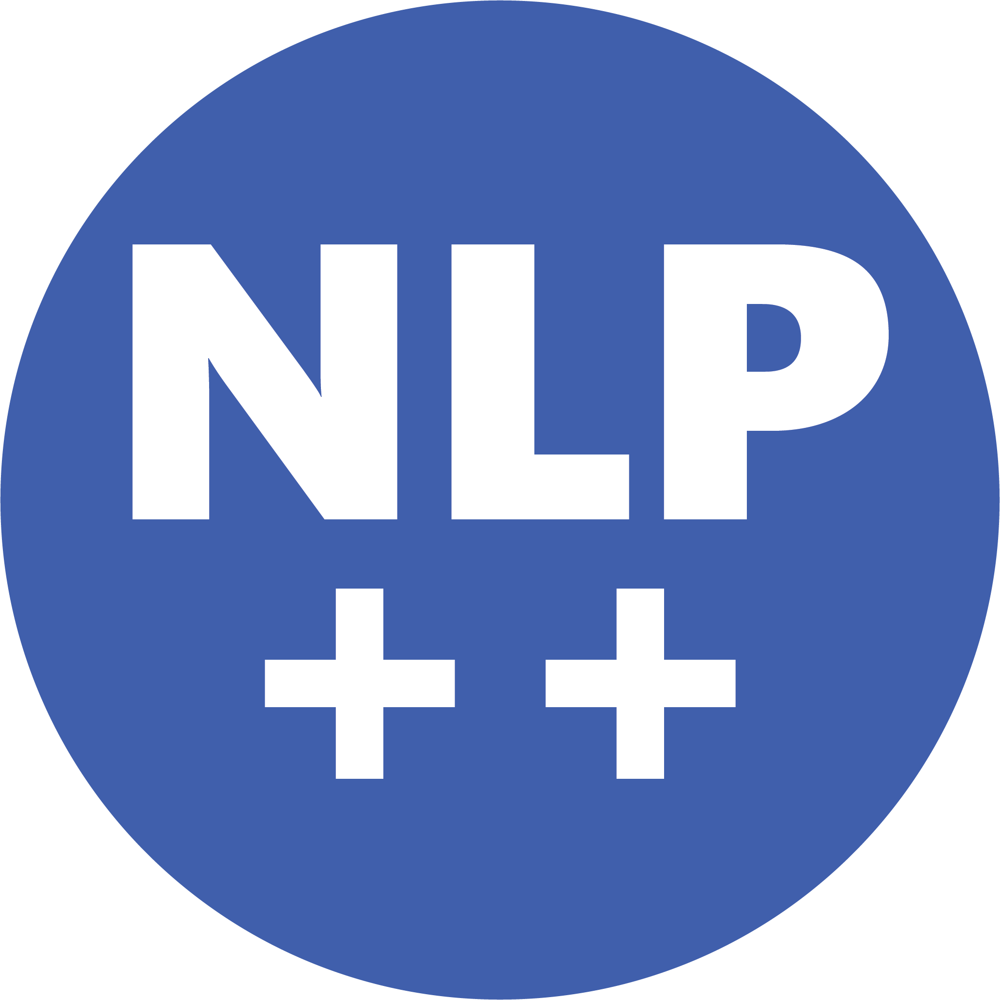

# NLP++ for VS Code — Help

Welcome to the **NLP++ Language Extension** for Visual Studio Code. This page is the
hub for the extension's help. Pick a topic below, or open any of these any time from
the **Help** view in the NLP++ sidebar or the 📖 book button on the view toolbars.

---

# 📘 Now Available — The NLP++ Textbook

**The first textbook on the NLP++ programming language is here — available world-wide.**
Written for programmers, it takes you from these help pages to real fluency: how the
language works, and how to build analyzers that parse text and extract information
**deterministically**.

NLP++ needs **no training data** — you write the rules and the analyzer behaves predictably
every time. That makes it a strong, auditable alternative to an LLM in **agentic flows**:
the logic is human-written code you can read, [test](testing.md), and ship.

### 🛒 Get your copy

- **Amazon** — [amazon.visualtext.org](https://amazon.visualtext.org)
- **BPB Online** — [book.visualtext.org](https://book.visualtext.org)

---

## Getting started

- **[Quick Start](quickstart.md)** — install the engine, create or open an analyzer, and run it over text.
- **Claude Prompts** — let Claude help you build a prototype analyzer. The Help view lists several ready-to-paste prompts, one per task; choose the one you need and it opens with your machine's engine and analyzer paths already filled in. Start with [**General pointers: Claude + NLP++**](prompts/00-general-pointers.md) for an overview of the library.
- **[Compiling Analyzers](compiling.md)** — turn an analyzer (and/or its knowledge base) into a fast compiled C++ library.
- **[Regression Testing](testing.md)** — set up golden-file regression tests so you catch changes in your analyzer's output.
- **[Lazy Loading](lazyload.md)** — keep startup fast and memory low by loading knowledge-base data only when it's needed.

## What's new — Version Notes

Significant releases get a short "what's new" page. The newest one you haven't seen
opens automatically the first time you run that version.

- **[3.2.0 — Help system, regression testing & Python passes](versions/3.2.0.md)**
- **[Version 3 — Compiled, Cloud-Built, and on npm](versions/3.0.0.md)**

## More help

- **[Master Help Index](../index.md)** — the full VisualText / NLP++ help table of contents.
- **[NLP++ Functions](../NLP_PP_Stuff/Functions.md)** and **[NLP++ Variables](../NLP_PP_Stuff/About_NLP++_Variables.md)**.