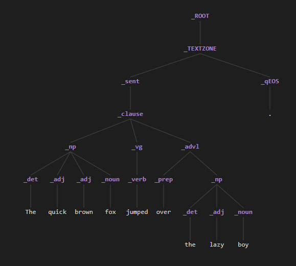

# Parse Trees

Every pass of an NLP++ analyzer writes out the **parse tree** as it stood when that pass
finished. Those trees are how you see what your rules actually did — which phrases got
built, out of which words, by which rule.

The extension gives you **two views of the same tree**: the `.tree` **text file**, which
carries all the detail, and the **parse-tree graphic**, which draws it as a classic
linguistic tree diagram.

[← Back to Help home](home.md)



## Where the trees are

When you analyze a text file, the engine writes a log folder next to it — `MyText.txt_log/`
— containing one `.tree` file per pass (`ana001.tree`, `ana002.tree`, …) plus `final.tree`
for the finished parse.

You can open them from the file tree, or:

- **Analyzer Sequence view** → right-click a pass → **Open Tree file** — the tree as of that pass.
- **Display Final Tree** (`Ctrl+Shift+F` / `Cmd+Shift+F` in a pass file) — the finished parse.
- **Display Pass Tree** (`Ctrl+Shift+T` / `Cmd+Shift+T` in a pass file) — the tree for the pass you're editing.
- **View selected tree** — right-click a selection in a text file to see just that portion.

## Reading the text tree

A `.tree` file is an indented list. Indent depth is the hierarchy, and each line is a node:

```
_ROOT [0,1429,0,1429,0,0,node,un]
   _paragraph [0,342,0,342,6,12,node,un]
      _sentence [0,183,0,183,5,24,node,un, ("name" "sentence1")]
         _city [0,10,0,10,8,13,node]
            LOS [0,2,0,2,0,0,alpha]
```

The label comes first, then the bracketed fields: the node's **character span** in the
text (`start,end`), the same span in the unnormalized text, the **pass number** and
**rule line** that built it, and the node **type** (`node`, `alpha`, `white`, …). Any
attributes the node carries follow in parentheses.

## What you can do from the text tree

Put your cursor on **any node line** — a word or a phrase, at any depth — and right-click:

- **Highlight text** — selects that node's span in the analyzed text file and opens it
  beside the tree. On a phrase node you get the whole phrase; on a word, the word.
- **Display Rule Fired** — opens the pass that built the node and jumps straight to the
  rule that fired. For nodes that came out of a dictionary, it searches the dictionaries
  instead.
- **Generate @PATH** — writes the context `@PATH` for that node, ready to paste into a rule.
- **Open Pass File** — opens the pass this tree came from.
- **Fold All** (`Ctrl+Shift+F`) / **Unfold All** (`Ctrl+Shift+U`), and fold/unfold
  recursively — collapse the tree text to the level you care about.

## The parse-tree graphic

From any `.tree` file:

- 🌲 **The tree button** in the editor title bar — draws the whole tree.
- 🖱️ **Right-click → Graph Entire Tree** — the same, from the context menu.
- 🖱️ **Right-click → Graph Selected Portion of Tree** — draws just the **selected lines**,
  or, with nothing selected, the **subtree under the cursor**. Use this to look at one
  phrase inside a large tree.

The graphic is **on-demand only**: opening a `.tree` file never draws anything by itself,
so tree files open instantly. It re-uses a single panel, so graphing another tree replaces
the one on screen rather than opening more tabs.

### Getting around

| Do this | Get this |
| --- | --- |
| **Scroll** | Zoom in and out |
| **Shift + scroll** | Squeeze or spread the horizontal spacing between nodes |
| **Drag** | Pan around the canvas |
| **Click a phrase node** | Open **one level** — just that node's children |
| **Click a word (leaf)** | Reveal it in the text — selects that word in the input file |
| **Right-click** | Menu (below) |

A tree opens fit to the window with the **root expanded and everything else closed**, so
you drill down one node at a time instead of facing hundreds of tokens at once. Small
trees (roughly 30 nodes or fewer) open fully.

Labels never pile up on each other: at every level, labels that would overlap are staggered
into the fewest extra rows needed, and they drop back onto one line as soon as they fit —
or as soon as you spread the tree out with Shift + scroll.

### The right-click menu

- **Reveal Text** — on **any** node, word or phrase. Selects that node's whole span in the
  analyzed text file. Right-click an `_np` and the entire noun phrase lights up.
- **Expand all below** / **Collapse all below** — open or close a whole subtree at once
  (offered on nodes that have children).
- **Center all** — fit the whole tree back into the window.
- **Expand all** / **Collapse all** — open or close the entire tree.

Whitespace tokens and the pass banners at the top of the file are left out of the graphic,
so what you see is the linguistic structure.

## Working with both views

The two views answer different questions, and they're best used together:

- **The graphic** shows you **shape** — how the parse came together, where a phrase
  attached, what got left flat.
- **The text tree** shows you **detail** — the spans, the attributes, the pass and rule
  that built each node, and the `@PATH` you need to write the next rule.

A common loop: graph the tree, drill down until you find the node that's wrong, right-click
**Reveal Text** to confirm what it covers, then go back to the `.tree` file and use
**Display Rule Fired** on that same node to land on the rule that needs fixing.

## See also

- **[Quick Start](quickstart.md)** — create or open an analyzer and run it over text.
- **[Node / Parse Tree Functions](../Table_of_Parse_Tree_Functions.md)** — the NLP++ functions that read and change the tree from inside a rule.
- **[About Parse Trees](../VisualText_Basics/About_Parse_Trees.md)** — the concept behind the tree.
- **[Regression Testing](testing.md)** — lock in the output once the tree looks right.
